## <center>**MetalLB Setup On Kubernetes Cluster**</center>


    
### **[1 . The Requirement for MetalLB]()**
    


In bare-metal Kubernetes deployments, the default configuration does not include the capability to create LoadBalancer-type services, which is where MetalLB comes into play.
    
  ### **[2. Environment Details:]()**
    
   Operating System: Ubuntu 20.04.6 LTS
    
  ### **[3. List of Tools and Technologies:]()**
    
  - Kubernetes
  - MetalLB
  - Podman/Docker 
    
    #### **[Kubernetes: ]()**
    
    Think of Kubernetes as a smart manager for your applications. Imagine you have lots of little workers (containers) who need to run your programs. Kubernetes is like a boss who organises and manages these workers efficiently. It makes sure your programs are running, scales them when needed, and even replaces them if they fail.
    
    #### **[MetalLB: ]()**
    
    Picture MetalLB as a friendly valet for your apps in Kubernetes. Normally, LoadBalancers help direct internet traffic to different services, like websites or apps. MetalLB does this even if you're not on a big cloud service (like Amazon or Google). It helps your Kubernetes apps get the right traffic and lets them talk to the world.
    
## **[4. Commands for the Setup or Configuration:]()**
    
 ### **[[a] Install Kubernetes:]()**
    
Here's a general outline of the steps to install Kubernetes on Ubuntu:

  Open a terminal and switch to the superuser (root) by entering the following command. You will be prompted to enter your user's password, not the root password.

```bash
sudo su
```
- **sudo su** is used to become the superuser in Unix-based systems, granting elevated administrative privileges. It often requires the user's password for authentication.


**Step 1. Update the system's package list and install necessary dependencies:**

Use the following commands to update the system's package list and keep your system secure:
    
```bash
sudo apt-get update
```
 - **'sudo apt-get update'** is a command in Debian-based Linux systems used to refresh the local package repository information, ensuring the system has the latest data about available software packages and their versions.

```bash
sudo apt-get upgrade
```

- **'sudo apt-get upgrade'** command updates installed packages to their latest available versions, helping to keep the system current and secure.


  ---
    
  **Step 2. Install Docker:**

Kubernetes relies on Docker for containerization. Use the following commands to install and manage Docker:

**Install Docker using the apt-get install command:**
    
  ```bash
sudo apt-get install docker.io
  ```
  - The **'apt-get install'** command in Debian-based Linux systems is used to install software packages from the distribution's repositories. You typically follow this command with the name of the package you want to install, like **apt-get install docker.io.**
  

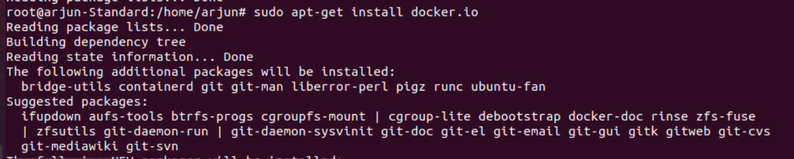

---
**Start the Docker service with:**
```bash
sudo systemctl start docker
```
  - The **'sudo systemctl start docker'** command is used to start the Docker service in a Linux system, allowing you to run containerized applications.

**Check the status and information of the Docker service using:**
```bash
sudo systemctl status docker
```
- The command **'sudo systemctl status docker'** is used to check the status and information of the Docker service in a Linux system. It provides details about whether Docker is running and its current status, as well as other related information.

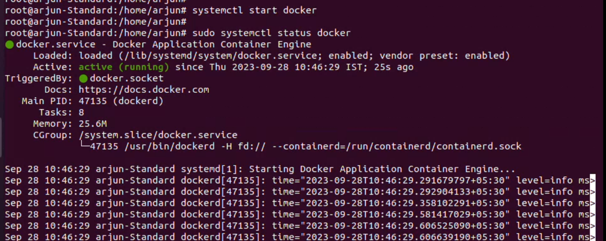
  
---
    
  **Step 3 :** **Install kubeadm, kubelet, and kubectl :**
  
  These are essential components of Kubernetes. Use the following commands to install them:

  **Install necessary packages for Kubernetes setup:**  
  ```bash
sudo apt-get install -y apt-transport-https curl
  ```
 - The command **'sudo apt-get install -y apt-transport-https curl'** is used in Debian-based Linux systems to install the apt-transport-https and curl packages with automatic "yes" responses to prompts, allowing you to securely retrieve data from repositories and download files from the internet.

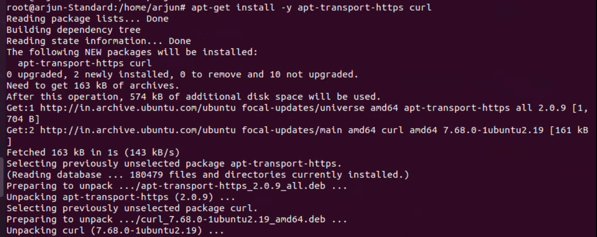

---
**Add the GPG key for Kubernetes:**
```bash
curl -s https://packages.cloud.google.com/apt/doc/apt-key.gpg | sudo apt-key add -
```
- This command fetches a GPG key from a URL and adds it to the system's trusted keys for package verification in Debian-based Linux systems.

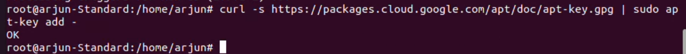

**Add the Kubernetes repository:**
```bash
echo "deb https://apt.kubernetes.io/ kubernetes-xenial main" | sudo tee /etc/apt/sources.list.d/kubernetes.list
```
```bash
sudo apt-get update
  ``` 
- The first command adds the Kubernetes repository to the system's package sources, and the second command updates the package list.

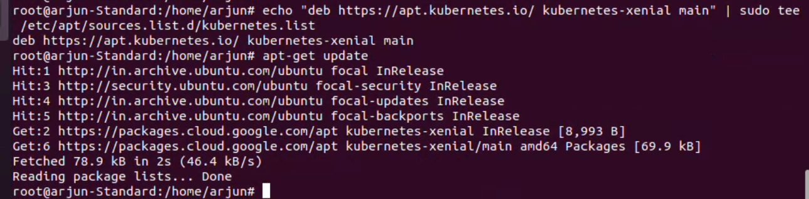

**Install kubelet, kubeadm, and kubectl:**
  ```bash
sudo apt-get install -y kubelet kubeadm kubectl 
  ``` 
  - This command installs the Kubernetes components kubelet, kubeadm, and kubectl with automatic "yes" responses to prompts.

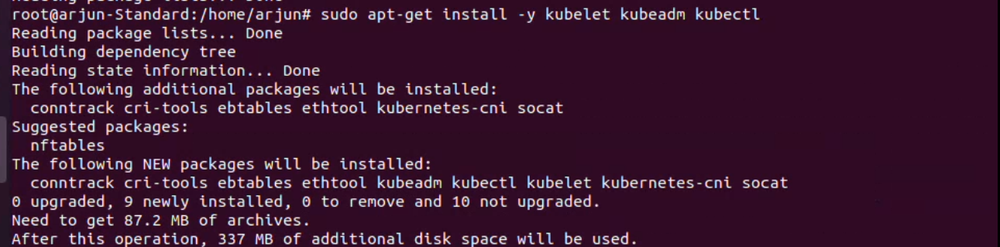

---
    
  **Disable swap space:**
    
  ```bash
sudo swapoff -a
  ```
  - The command **'sudo swapoff -a'** is used to deactivate or turn off all swap partitions on a Linux system, effectively disabling swap space.


   **Install the vim text editor:**

  ```bash
sudo apt-get install vim
  ```
 - The command **'sudo apt-get install vim'** is used to install the Vim text editor on a Debian-based Linux system. It requests superuser privileges (sudo) to execute the installation of Vim.

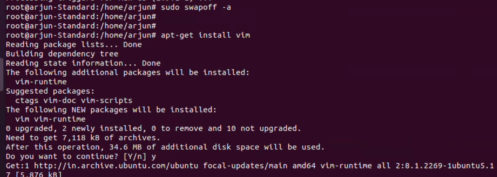
  ---
  **If there are any swap entries in the /etc/fstab file, remove them using a text editor such as vim:**

    
  ```bash
sudo vim /etc/fstab
  ```
  - The command **'sudo vim /etc/fstab'** opens the /etc/fstab file for editing using the Vim text editor with superuser privileges, allowing you to make changes to the system's file table and manage file system mount points.

  Before changes **[/swapfile]**

      # /etc/fstab: static file system information.
      #
      # Use 'blkid' to print the universally unique identifier for a
      # device; this may be used with UUID= as a more robust way to name devices
      # that works even if disks are added and removed. See fstab(5).
      #
      # <file system> <mount point>   <type>  <options>       <dump>  <pass>
      # / was on /dev/vda5 during installation
      UUID=03f31c10-c7dd-4f6a-8511-d5328e3341db /               ext4    errors=remount-ro 0       1
      # /boot/efi was on /dev/vda1 during installation
      UUID=8304-4F6B  /boot/efi       vfat    umask=0077      0       1
      /swapfile                                   none            swap    sw              0       0
      
  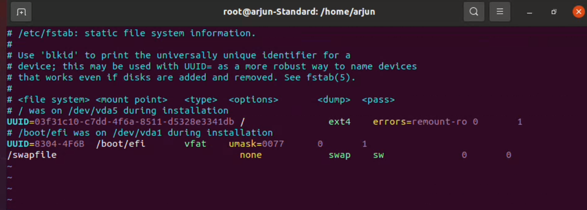  

  After changes **[#/swapfile]**

        # /etc/fstab: static file system information.
        #
        # Use 'blkid' to print the universally unique identifier for a
        # device; this may be used with UUID= as a more robust way to name devices
        # that works even if disks are added and removed. See fstab(5).
        #
        # <file system> <mount point>   <type>  <options>       <dump>  <pass>
        # / was on /dev/vda5 during installation
        UUID=03f31c10-c7dd-4f6a-8511-d5328e3341db /               ext4    errors=remount-ro 0       1
        # /boot/efi was on /dev/vda1 during installation
        UUID=8304-4F6B  /boot/efi       vfat    umask=0077      0       1
        #/swapfile                                 none            swap    sw              0       0
          
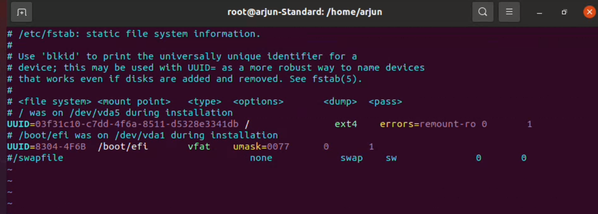

---
    
  **Enable kernel modules:**
    
  ```bash
sudo modprobe br_netfilter
  ```
  - The command **'sudo modprobe br_netfilter'** is used to load the br_netfilter kernel module with superuser privileges, typically used for configuring and managing network-related functionalities, particularly for Docker and Kubernetes networking

  **Add some settings to sysctl:**
    
  ```bash
sudo sysctl -w net.ipv4.ip_forward=1
  ```
  - The command **'sudo sysctl -w net.ipv4.ip_forward=1'** is used to enable IP forwarding in a Linux system, allowing it to act as a router or forward network traffic between network interfaces. This requires superuser privileges.

  
  
  ---
    
  #### **[Initialize the Cluster (Run only on master)]()**
 
    
  **Step 4: Initialize Kubernetes Master Node (Control Plane)** 

On the master node, you'll initialize Kubernetes using kubeadm. 

**Initialize the master node:**  
  ```bash
sudo kubeadm init
  ```
  - The command **'sudo kubeadm init'** is used to initialize a Kubernetes control-plane node with superuser privileges, setting up the core components and configurations for a Kubernetes cluster.

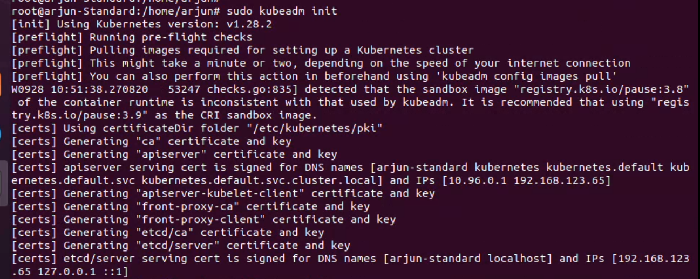
    
  Follow the instructions provided by the command, including setting up the network pod (CNI) and configuring kubectl for your user.

---
    
  **Step 5 :** **Configure Kubectl :** 
  You need to configure kubectl to communicate with the Kubernetes cluster. This is usually done by copying the Kubernetes configuration file into your home directory.

**Create the .kube directory in your home directory:**
  ```bash
mkdir -p $HOME/.kube
  ```
  - The command **'mkdir -p $
  $HOME/.kube'** is used to create a directory named .kube in the user's home directory (usually ~/ or $HOME) with the -p flag to create the parent directory if it doesn't exist. This directory is commonly used for storing Kubernetes configuration files.


**Copy the Kubernetes configuration file into your .kube directory:**
  ```bash
sudo cp -i /etc/kubernetes/admin.conf $HOME/.kube/config
  ```
  - The command **'sudo cp -i /etc/kubernetes/admin.conf'** is used to copy the Kubernetes configuration file named admin.conf from the /etc/kubernetes/ directory to the current directory. The -i option prompts for confirmation if the destination file already exists. However, you haven't specified the destination path, so it's an incomplete command.

**Change the ownership of the Kubernetes configuration file:**
```bash 
    sudo chown $(id -u):$(id -g) $HOME/.kube/config
```
 - The command is used to change the ownership of the Kubernetes configuration file, config, in the user's .kube directory to match the user's own UID (user ID) and GID (group ID). This ensures that the user has the necessary permissions to access and modify the Kubernetes configuration.

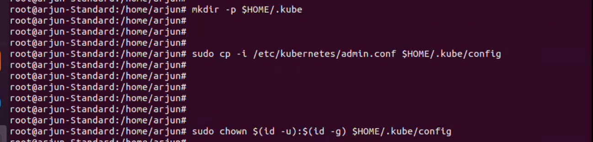
---

**Interact with the Kubernetes cluster:**
```bash
kubectl get pods --all-namespaces
```
- The command **'kubectl get pods --all-namespaces'** is used to list all the pods across all namespaces in a Kubernetes cluster, displaying information about their current status and health.


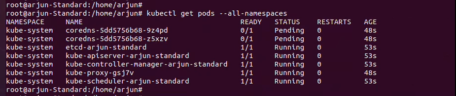

---
    
  ```bash
kubectl get nodes
  ```
- The command **'kubectl get nodes'** is used to retrieve a list of all the nodes in a Kubernetes cluster. It provides information about the nodes' status, such as their availability and readiness.


---


**Step 6: Install a Network Plugin :**

Kubernetes requires a network plugin for communication between pods across different nodes. A popular choice is Calico. You can apply a taint to the node as follows:

**Inspect the taints applied to a specific node named "arjun-standard":**
  ```bash
kubectl describe nodes arjun-standard | grep -i taints
  ```
  - The command **'kubectl describe nodes arjun-standard | grep -i taints'** is used to describe a specific node named "arjun-standard" in a Kubernetes cluster and filter the output for lines containing the word "taints." This command helps you inspect the taints applied to the specified node, which can affect how pods are scheduled onto that node.

  
  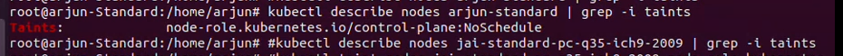

---

**Apply a taint to the node "arjun-standard" and remove it:**
  ```bash
kubectl taint nodes arjun-standard node-role.kubernetes.io/control-plane:NoSchedule-
  ```
  - The command **'kubectl taint nodes arjun-standard node-role.kubernetes.io/control-plane:NoSchedule-'** is used to apply a taint to a specific Kubernetes node named "arjun-standard." The taint, in this case, is named "node-role.kubernetes.io/control-plane" with the effect "NoSchedule," which means new pods won't be scheduled on this node unless they have the corresponding toleration to match the taint. The trailing hyphen ("-") indicates the taint is being removed in this command.

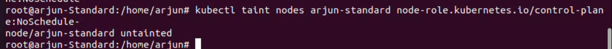

---
  ```bash
kubectl get pods --all-namespaces
  ```
  - The command **'kubectl get pods --all-namespaces'** is used to list all the pods running in a Kubernetes cluster, regardless of the namespace they belong to. This command provides information about the pods' current status and health across all namespaces in the cluster.

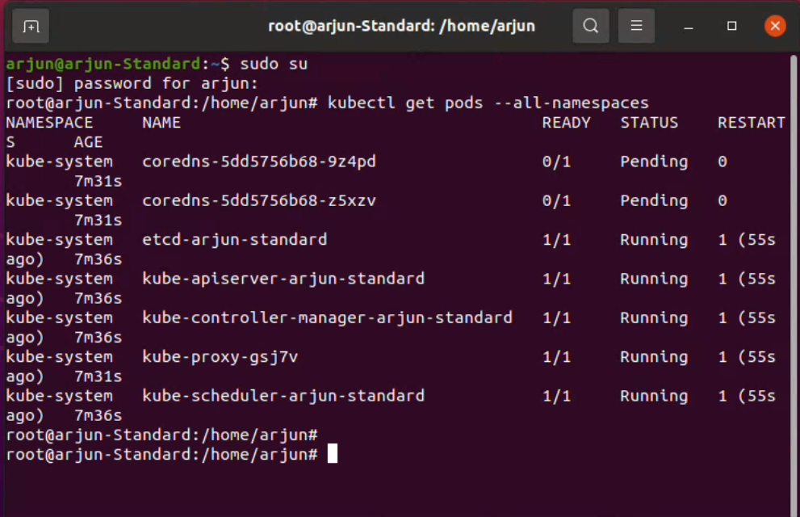

  -----
  **NOTE: This command is run only on Master Node.**

    

```bash
sudo vim calico.yaml
```
- The command **'sudo vim calico.yaml'** is used to open the "calico.yaml" file for editing with superuser privileges using the Vim text editor. This is often done to configure or customize the Calico network plugin for a Kubernetes cluster.

**Attention please**
Calico.yaml is not described due to it being in long code. Its yaml file is attached to Metallb repository.

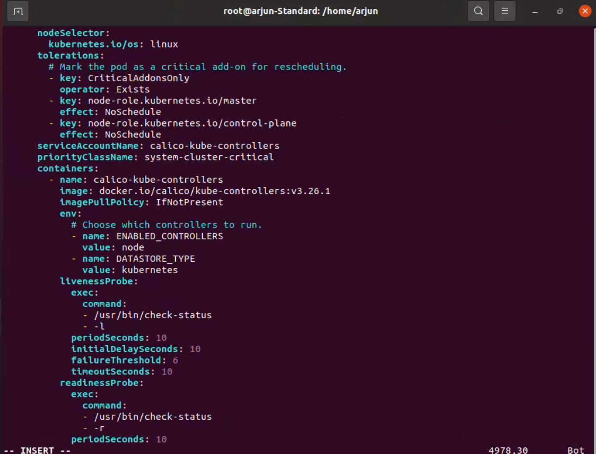
  -------
  ---
  **Apply the Calico configuration to the cluster:**
  ```bash
    kubectl apply -f calico.yaml
  ```
  - The command **'kubectl apply -f calico.yaml'** is used in Kubernetes to apply the configuration defined in the "calico.yaml" file to the cluster. It will create or update resources based on the specifications in the YAML file, typically used for setting up network policies and other configurations in a Kubernetes cluster.

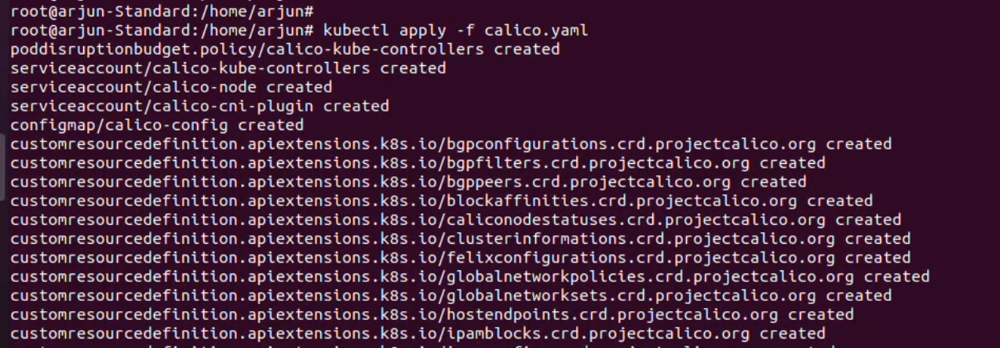

---
**Verify that all the pods are up and running:**
  ```bash
kubectl get pods --all-namespaces
  ```
- The command **'kubectl get pods --all-namespaces'** is used to retrieve a list of all pods running in a Kubernetes cluster, regardless of the namespace they belong to. This command provides information about the pods' current status and health across all namespaces in the cluster.

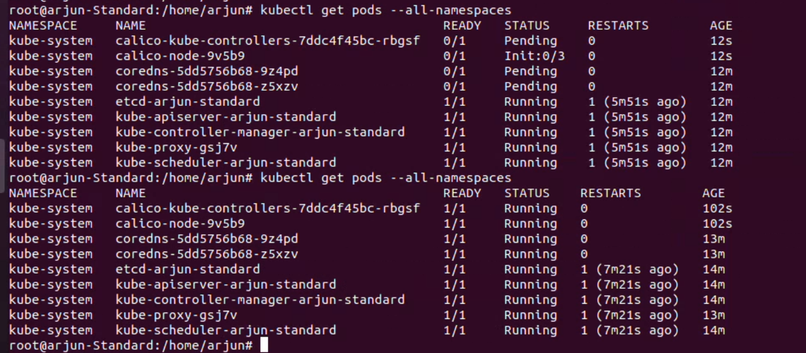
   
---
      
  ### **[[b] . Install MetalLB](https://64dc91a6ec22134a66be2ca2--remarkable-meringue-804b9a.netlify.app/#/?id=b-install-metallb)**
    
  MetalLB is a load balancer implementation for bare metal Kubernetes clusters. It provides a network load balancer implementation for services that use the type LoadBalancer.

  **Download Helm:**

  Visit the Helm release page **(https://github.com/helm/helm/releases)** to download the Helm binary.

  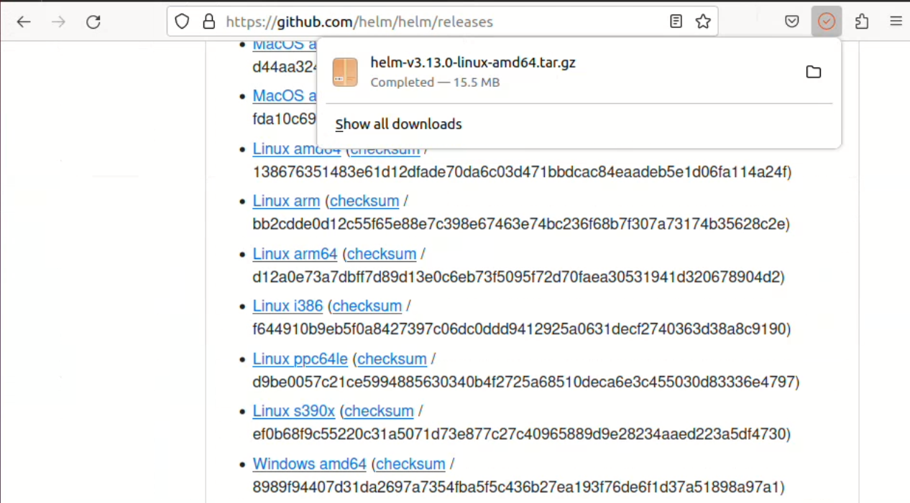

  ---
   **Go to download repository:**

**Extract Helm:**

Extract the Helm archive using the following command:
  ```bash
tar -xvf helm-v3.13.0-linux-amd64.tar.gz
  ```
  - The **'tar -xvf'** command extracts the contents of the compressed Tar archive, making Helm's executable files available.

**Move Helm:**

Move Helm to a directory in your system's PATH:
  ```bash
    sudo mv linux-amd64/helm /usr/local/bin/helm
  ```
  - The command **'sudo mv linux-amd64/helm /usr/local/bin/helm'** is used to move the Helm binary executable from the "linux-amd64" directory to the "/usr/local/bin" directory with superuser privileges. This makes Helm accessible as a system-wide command, allowing users to run Helm commands from any location in the system.
  

  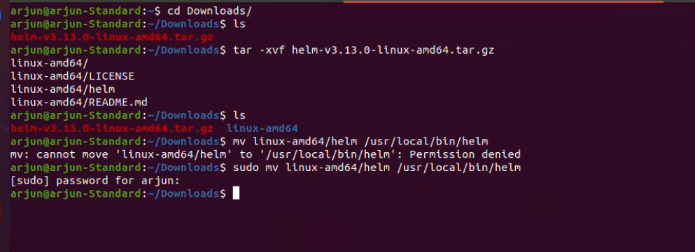


**Check Helm Version:**

To verify the installation, run:
  ```bash
helm version
  ```
  - The command **'helm version'** is used to display the version of Helm, a package manager for Kubernetes, installed on your system. It will provide information about the Helm version currently in use.

**Create a Kubernetes Namespace for MetalLB:**

Create a dedicated namespace for MetalLB:
  ```bash
kubectl create ns metallb
  ```
  - The command **'kubectl create ns metallb'** is used to create a new Kubernetes namespace named "metallb." Namespaces in Kubernetes provide a way to organize and isolate resources within a cluster. This command creates a new namespace specifically for the use of MetalLB, a load balancer for Kubernetes.

  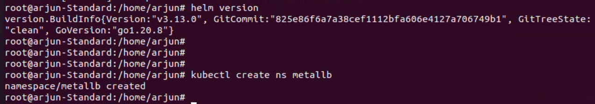
  ---

**Add MetalLB Helm Repository:**

Add the MetalLB Helm chart repository:
  ```bash
helm repo add metallb https://metallb.github.io/metallb
  ```

- The command helm repo add metallb https://metallb.github.io/metallb is used to add a Helm chart repository named "metallb" with the URL "https://metallb.github.io/metallb" to your Helm configuration. This allows you to easily access Helm charts for MetalLB, a load balancer for Kubernetes, from that repository.


**Install MetalLB:**

Install MetalLB using Helm:
```bash
helm install metallb metallb/metallb  
```
- The command helm install metallb metallb/metallb is used to deploy the MetalLB load balancer in a Kubernetes cluster using Helm. It instructs Helm to install the MetalLB chart from the "metallb" repository into your cluster, creating the necessary resources for MetalLB to function as a load balancer.

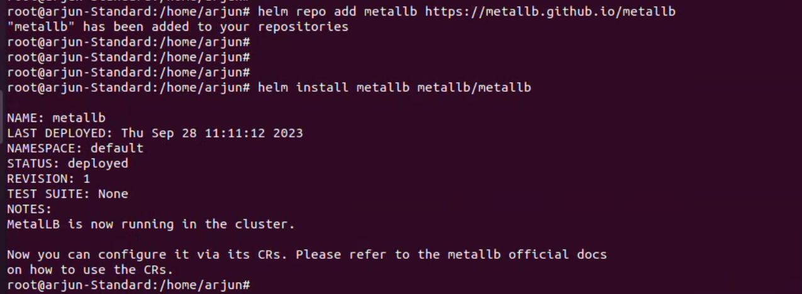

  ---

   **MetalLB is now running in the cluster.**

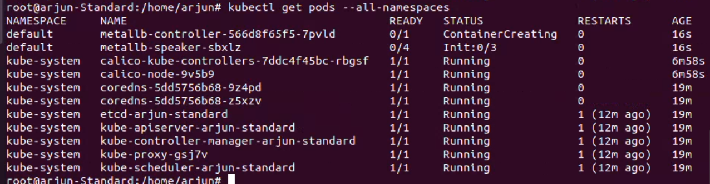
  ---
   
    
**Install sipcalc:**

Install the sipcalc tool to calculate IP network parameters:
    
  ```bash
sudo apt-get install sipcalc
  ```
- This command installs the sipcalc utility on a Debian-based Linux system, used to calculate IP network details.

**Calculate IP Details:**

Use sipcalc to calculate information about an IP address range:
```bash
sipcalc 192.168.123.65/24
```
- This command calculates and displays details about the specified IP address range, including network and broadcast addresses.

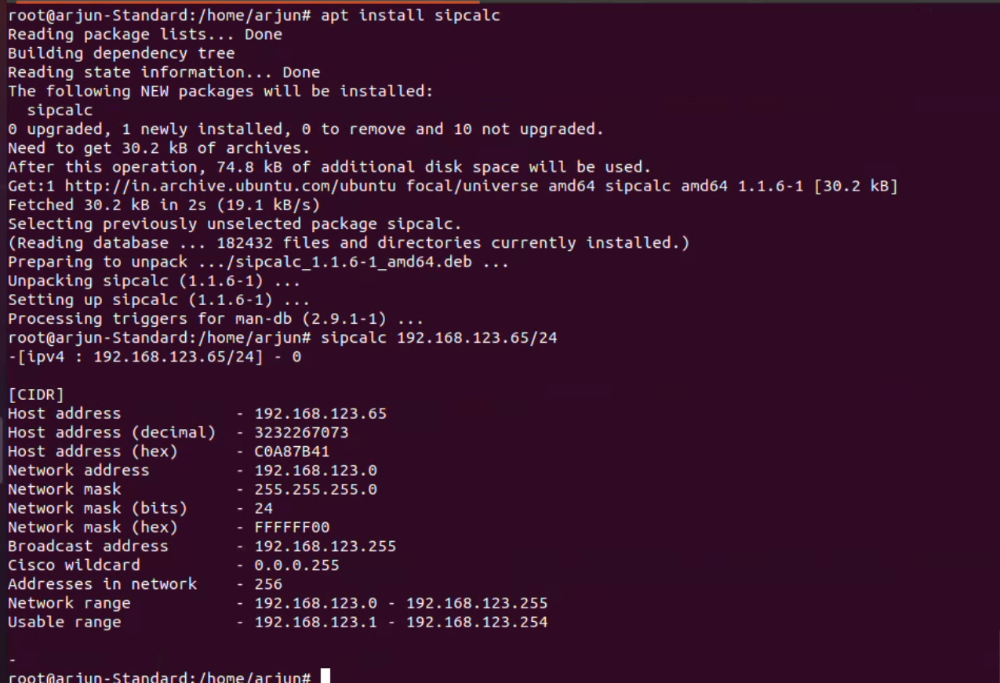

  ---
    
**Create ConfigMap for MetalLB:**

Create a ConfigMap for MetalLB configuration. You can use a text editor like Vim to create the cm.yaml.
    
  ```bash
sudo vim cm.yaml
  ```
  - The command cat cm.yaml is used to display the contents of the file named "cm.yaml" in the terminal. It simply prints the content of the file to the standard output.
    
```yaml
    apiVersion: v1
    kind: ConfigMap
    metadata:
      name: config
    data:
      config: |
        address-pools:
        - name: default
          protocol: layer2
          addresses:
          - 192.168.123.1-192.168.123.254
```
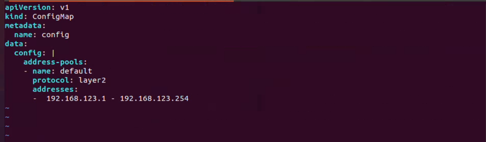

 ---
**Apply the configuration:**
 
```bash
kubectl apply -f cm.yaml
```
- This creates a ConfigMap with the configuration for MetalLB, specifying an address pool.


----

**Verify Pods:**

You can verify the pods in the current namespace with:
  ```bash
kubectl get pods
  ```
- The command kubectl get pods is used in Kubernetes to list all the pods running in the current namespace, providing information about their current status and health.

```bash
kubectl get pods -o wide
```
- The command kubectl get pods -o wide is used in Kubernetes to list all the pods running in the current namespace with additional details, including the node name and IP address, providing a wider range of information about the pods' current status and locations.

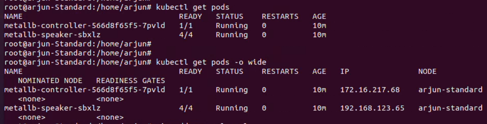

--
   **If above config file is not working due metallb version, then apply this manifest file for ipaddress pool.**

```bash
sudo vim addresspool.yaml
``` 
  - The command sudo vim addresspool.yaml opens the "addresspool.yaml" file for editing with superuser privileges using the Vim text editor.

```yaml
apiVersion: metallb.io/v1beta1
kind: AddressPool
metadata:
  name: doc-example-cidr
spec:
  protocol: layer2
  addresses:
    - 192.168.123.2/24

```
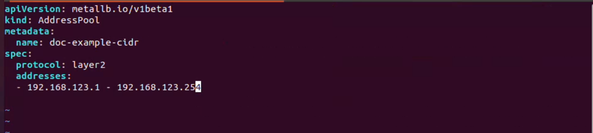
---
    
```bash
kubectl apply -f addresspool.yaml
```
  - The command kubectl apply -f addresspool.yaml is used in Kubernetes to apply the configuration defined in the "addresspool.yaml" file to the cluster, typically used for configuring address pools or resources for network services.

**Check Service Details:**

List all services in the current namespace:
```bash
kubectl get svc
```
- The command kubectl get svc is used in Kubernetes to list all the services running in the current namespace, providing information about their current status and properties.


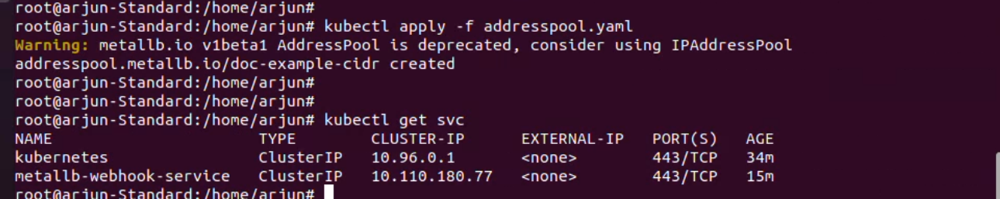


```bash
kubectl get pods --all-namespaces
```
- kubectl get pods --all-namespaces lists all pods in a Kubernetes cluster across all namespaces.
  
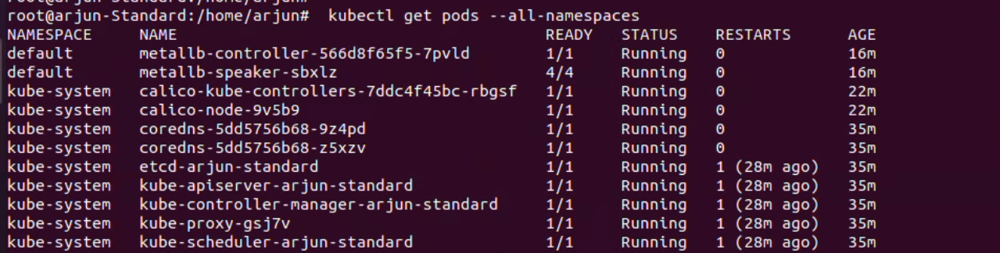

---
    
**Step 7: Deploy a Sample Nginx Application**

To deploy a sample Nginx application, use the following commands.

Create a deployment named "nginx" using the Nginx container image:
```bash
kubectl create deploy nginx --image nginx
```
- The command kubectl create deploy nginx --image nginx is used to create a deployment in a Kubernetes cluster named "nginx" using the "nginx" container image, which will deploy instances of the Nginx web server.

Expose the "nginx" deployment as a LoadBalancer service:
```bash
kubectl expose deploy nginx --port 80 --type LoadBalancer
```
- The command kubectl expose deploy nginx --port 80 --type LoadBalancer is used to expose a deployment named "nginx" in a Kubernetes cluster on port 80 with a LoadBalancer type service, allowing external access to the Nginx deployment.

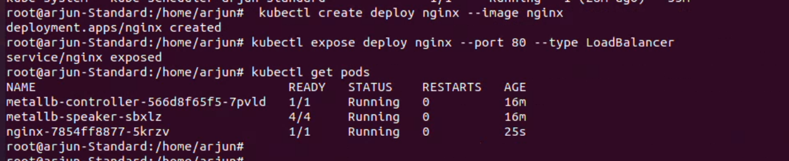

  ---
    
  Now you can configure it via its CRs. Please refer to the metallb official docs on how to use the CRs.
    
  You should see an IP address assigned to the **EXTERNAL-IP** column.
    
  MetalLB is now **set up** in your Kubernetes cluster running on Ubuntu. It's helping to distribute traffic and make your applications accessible through the IP you've configured
    
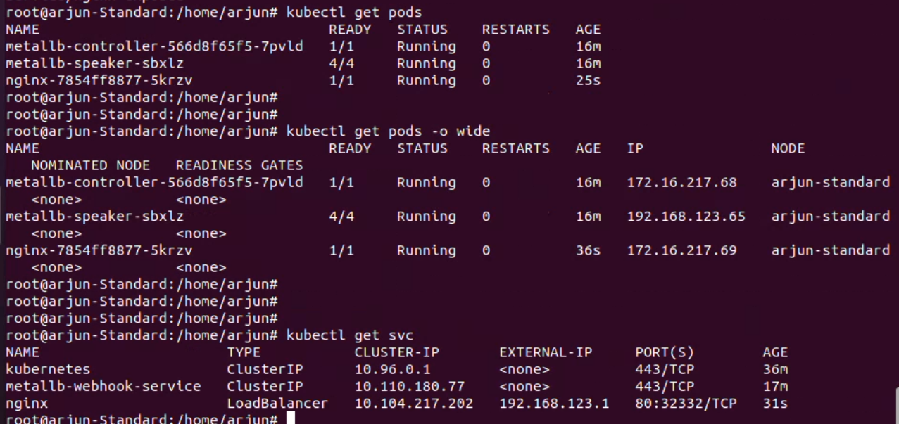

  ----
    
    
  **Now hit on browser with http://192.168.123.1:80**
    
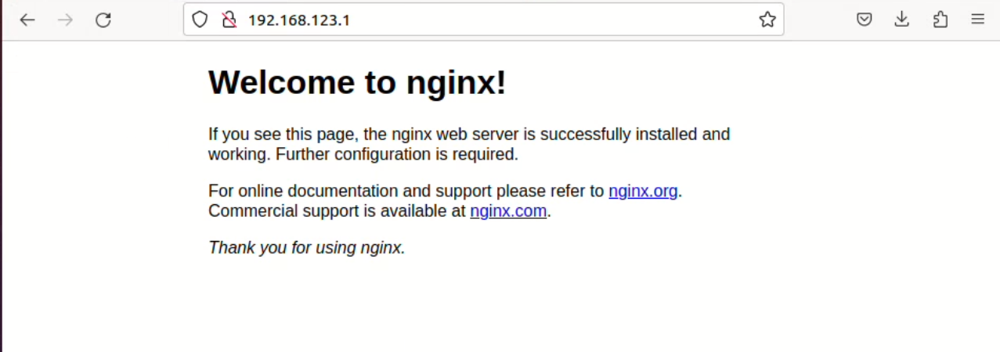

    
  ----

## **[5 . Reference link for Setup kubernetes cluster :]()** 
    

    
  [https://www.linuxtechi.com/install-kubernetes-on-ubuntu-22-04/](https://www.linuxtechi.com/install-kubernetes-on-ubuntu-22-04/)
    
  Metallb installation with helm chart
    
  [https://metallb.universe.tf/installation/](https://metallb.universe.tf/installation/)
    
</aside>


